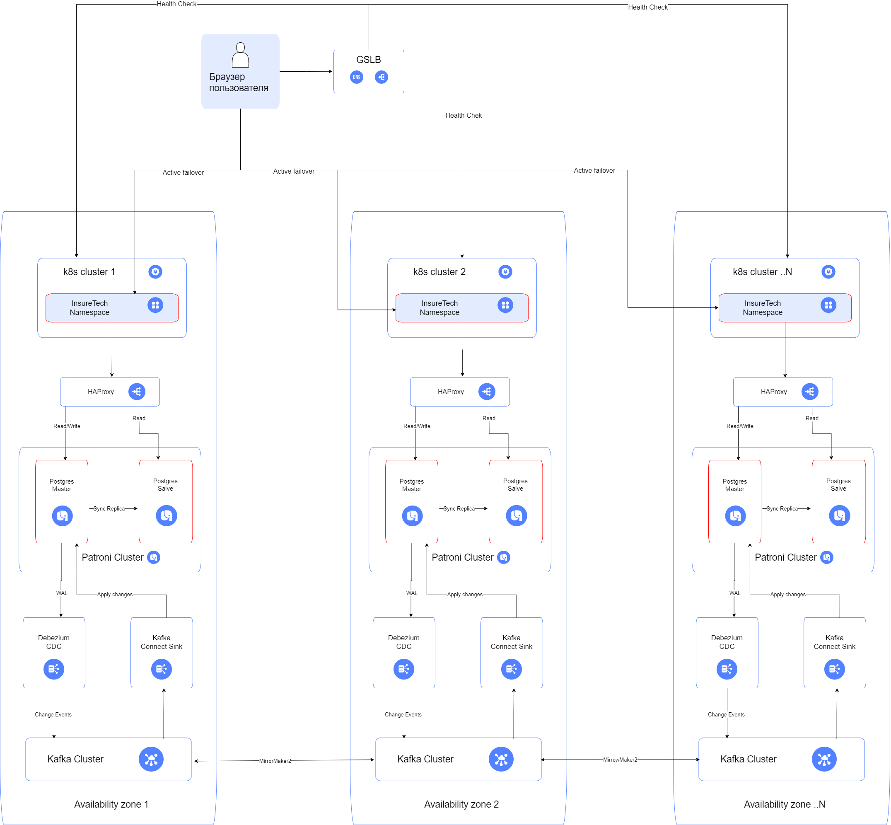

# Задание 1. Проектирование технологической архитектуры

## Ссылка на схему

[drawio](./InsureTech_технологическая_архитектура_to-be.drawio)

## Описание

### 1. Стратегия масштабирования и отказоустойчивости

#### Горизонтальное масштабирование выбрано как основная стратегия, так как:

 - Позволяет линейно наращивать мощность при росте пользователей.
 - Обеспечивает отказоустойчивость за счет избыточности экземпляров сервисов.
 - Поддерживает автоматическое масштабирование (HPA) в Kubernetes.

Отказоустойчивость обеспечивается через:
 - Геораспределенную архитектуру с активными кластерами в каждой зоне доступности
 - Автоматический фейловер на всех уровнях (GSLB, Kubernetes, БД)
 - Избыточность всех критических компонентов

Для создания зон безопасности испрользуются изолированные сети для межсервисного взаимодействия и шифрование трафика при взаимодействии ЦОД-ов в разных регионах.

### 2. Развертывание в Kubernetes

#### a. Конфигурация развертывания
Выбраны независимые кластеры в каждой зоне доступности, потому что:
 - Минимизация задержек: Все компоненты внутри региона взаимодействуют локально.
 - Изоляция сбоев: Проблемы в одном кластере не влияют на другие.
 - Упрощение управления: Нет сложных cross-region зависимостей.

#### b. Подход к балансировке
Трехуровневая система:
 - Глобальный уровень (GSLB)
    Health checks (HTTP/HTTPS).
    Распределение трафика по ближайшему рабочему региону.
 - Уровень Kubernetes
 	Независимый кластер в каждом регионе
 	Horizontal Pod Autoscaler (HPA) при увеличении Request Per Second (RPS) 
 - Уровень базы данных
    HAProxy для разделения:
     Запись -> Master.
     Чтение -> Master + Slave.
    Паттерн CQRS для разделения нагрузки.

#### c. Фейловер-стратегия 
Active-Active для приложения
 - Клиенты направляются в ближайший рабочий регион через GSLB.
 - При падении региона трафик автоматически переключается.

Active-Standby для БД
    Patroni управляет автоматическим фейловером PostgreSQL внутри региона.
    RTO < 45 мин, RPO < 15 мин обеспечивается за счет
     - Синхронной репликации внутри зоны доступности.
     - Асинхронной логической Master-Master репликации между зонами доступности. 

#### d. Репликация и бэкапирование

PostgreSQL High Availability на уровне зоны доступности обеспечивается наличием 2 узлов (Master + Slave) в кажой зоне в составе синхронной репликации. Применен паттерн CQRS для разделения нагрузки.
Для оркестрации и быстрой замены Active на Standby внутри зоны доступности используется Patroni.
Между базами данных разных зон доступности реализована асинхронная логическая Master-Master репликация на основе решения Debezium + Kafka. Данная схема репликации возможна и целесообразна по следующим причинам:
 - Общий объем БД не велик. Даже полная перезаливка дампа между зонами доступности при канале 1G не займет более 10 мин. А значит данные репликации не будут велики и возможно обеспечения приемлемой синхронности данным между БД разных зон доступности.
 - Данные о клиентах, а также об оформленных ими продуктах харнятся в ins-comp-settlement-db. С одной стороны эти данные требуют высокой скорости синхронизации, но с другой объем их изменения не велик. И при заданных RPO < 15 мин в данной схеме можно обеспечить их синхронизацию с БД других зон доступности. Данные которые хранятся в core-db не требуют высокой степени синхронизации, т.к. заявки от клиентов вполне могут храниться в рамках одной зоны доступности. В теории их можно вообще убрать из синхранизации (т.к. успешно оформленные заявки попадают в другие БД и гарантированно синхранизируются).
 Данные по тарифам страховых компаний, которые также храняться в core-db едины для всех зон доступности и меняются синхронно в один и тот же момент времени при опросе систем страховых компаний. 
 - иметь возможность переключения запросов к БД от сервисов уровня приложения в разных зонах доступности не вижу смысла, т.к. есть требование иметь одинаковое время загрузки страниц для пользователей из разных регионов, которое будет в любом случае нарушено при полном отказе кластера БД в зоне доступности. В данном случае, на время проведения аварийно восстановительных работ, пользователи полностью переключаются на другую зону на уровне GSLB.

Таким образом при данной схеме организации репликации обеспечиваются заданные RTO и RPO, при этом обеспечивается распределение нагрузки на БД внутри зоны доспуности. 

#### Шардирование
Не используется, так как:
 - Объем данных (50 GB) не требует шардинга.
 - Нет экстремальных нагрузок на запись.

