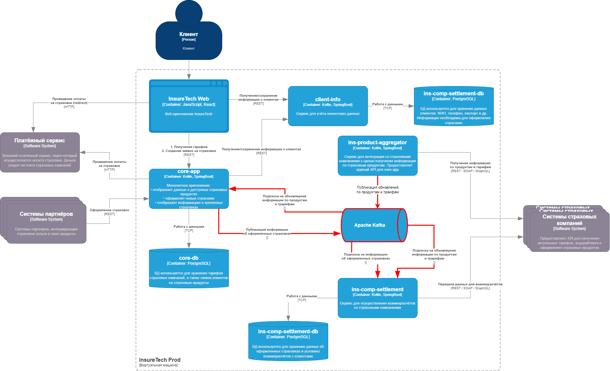

# Задание 3. Переход на Event-Driven архитектуру

## Ссылка на схему

[drawio](./InsureTech_C4_сontainer-diagram.drawio.xml)

## Анализ текущей архитектуры и выявление проблем

Текущая архитектура InsureTech основана на синхронных REST-вызовах между сервисами и внешними системами, что приводит к следующим проблемам и рискам:

### Проблемы с производительностью:
 - Сервис ins-product-aggregator выполняет синхронные запросы к пяти страховым компаниям, что увеличивает время ответа. При добавлении ещё пяти компаний задержки возрастут.
 - Время самого медленного ответа старновится миримальным временем работы сервиса

### Надёжность:
 - Ошибки взаимодействия с API страховых компаний могут привести к сбоям в работе ins-product-aggregator и, как следствие, в core-app и ins-comp-settlement.
 - Синхронные запросы создают сильную связность между сервисами, что усложняет обработку ошибок и восстановление после сбоев.

### Масштабируемость:
 - При добавлении новых страховых компаний время работы сервиса полечения информации о продуктах и трарифах линейно возрастает на время ответа нового API страховой компании
 - При увеличении количества страховых компаний нагрузка на ins-product-aggregator возрастёт, что может потребовать вертикального масштабирования, что не всегда эффективно.

## Для устранения этих проблем предлагается перейти на Event-Driven архитектуру. 
Основные изменения:

### Введение Event Bus - Apache Kafka:
 - Сервис ins-product-aggregator будет публиковать события об обновлении данных о продуктах и тарифах в топик Kafka.
 - Сервисы core-app и ins-comp-settlement будут подписаны на эти события и обновлять свои локальные реплики в реальном времени.
 - Сервис core-app будет публиковать события об оформленных страховках
 - Сервис ins-comp-settlement будут подписан на эти события 

### Использование паттерна Transactional Outbox
Для взаимодействия сервисов core-app и ins-comp-settlement критично гарантировать публикацию сообщений в очередь при успешном оформлении страковки. Поэтому в данном случае целесообразно использование паттерна Transactional Outbox

