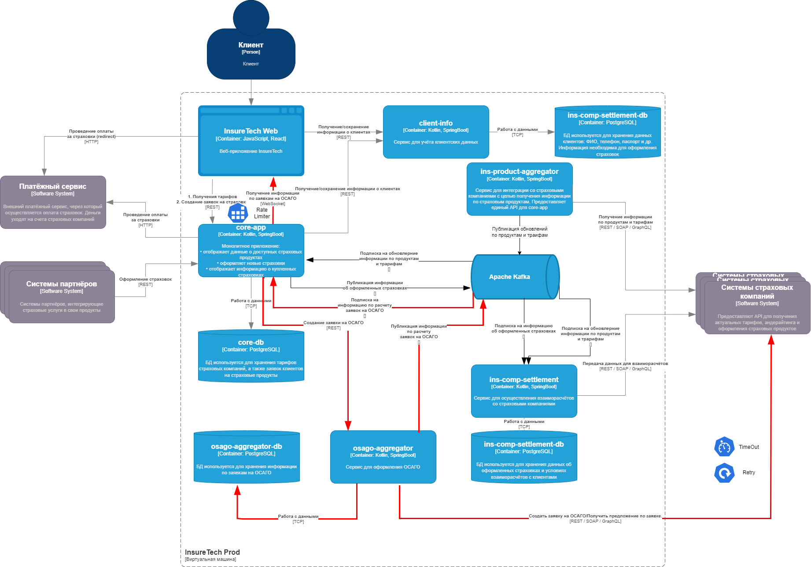

# Задание 4. Проектирование продажи ОСАГО

## Ссылка на схему

[drawio](./InsureTech_C4_сontainer-diagram.drawio.xml)

## Детали

- Сервису требуется свое хранилище, для сохранения информации по заявки, как минимум ID под которым она взята в работу и параметры.
- Для создания завки из core-app используется REST API, т.к. это разовая и быстра операция. При это сервис тут же регистрирует данную заявку в своей базе данных и возвращает в core-app id заявки. Далее получение требуемой информации от сервисов страховых компаний будет просиходить в асинхронном режиме. core-app подписан на события по созданой заявке, а osago-aggregator публикует данные по мере поступления успешных ответов от страховых компаний.
- Web приложение по аналогичной схеме взаимодействует с core-app. Т.е. создание заявки просиходит по REST API, а получение информации по результатам расчета по подписке через WebSocket.
- Для взаимодействия между core-app и Web понадобиться Rate Limiting, для взаимодействия osago-aggregator со старховыми компаниями Retry и Timeout.

